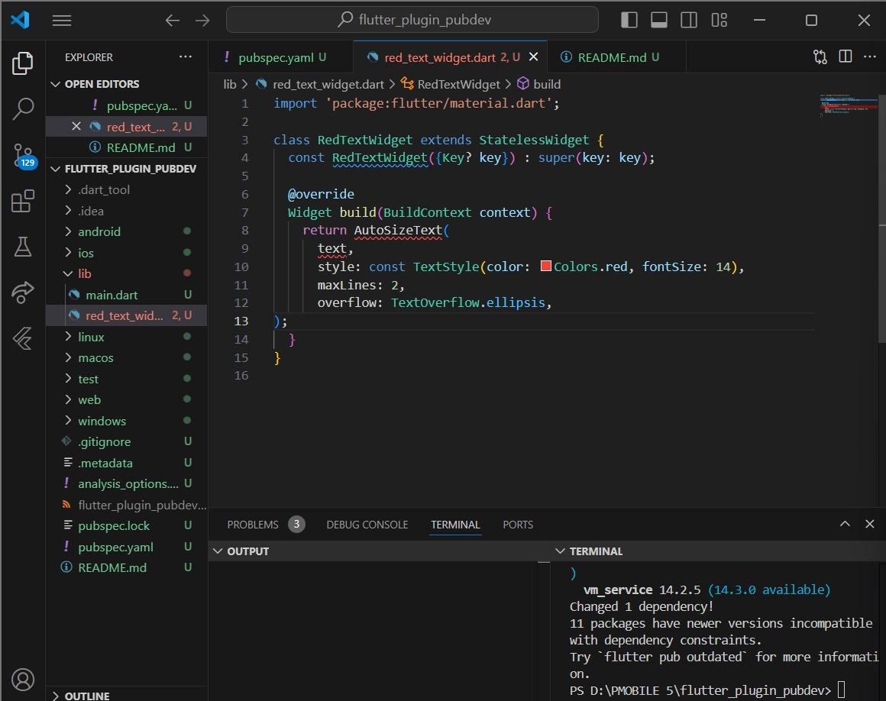

# flutter_plugin_pubdev

A new Flutter project.

## Getting Started

This project is a starting point for a Flutter application.

Nama    : Firstia Aulia Wida Azizah

Kelas   : TI3H / 2241720135

# Praktikum Bagian 7

- Membuat project baru flutter dengan nama flutter_plugin_pubdev
- Lalu menambahkan plugin melalui terminal dengan perintah 'flutter pub add auto_size_text'
- Membuat file baru red_text_widget.dart 
- Menambahkan widget AutoSizeText dengan mengganti return Container menjadi return AutoSizeText dengan isi di dalamnya.
Kode mengalami error seperti berikut :

Karena setelah menginstall plugin kita belum mengimpor auto_size_text ke dalam file red_text_widget.dart
- Perbaikan :

Yang dilakukan adalah dengan menambahkan baris kode di atas bagian import 'package....' serta mengganti kata 'text' setelah return dengan mengisi text tersebut.
- Membuat variabel text dan parameter di constructor , serta menambahkan widget pada file main.dart. Dan berikut adalah hasil final dari praktikum ini.

## Soal

1. Jelaskan maksud dari langkah 2 pada praktikum tersebut!
- Plugin merupakan paket eksternal yang menyediakan fungsionalitas tertentu yang tidak ada di flutter secara default. Pada praktikum ini menggunakan perintah 'flutter pub add auto_size_text' dan menjalankannya melalui terminal , yang akan otomatis ada entri baru di bagian dependencies dalam file pubspec.yaml yang menandakan bahwa plugin sudah berhasil ditambahkan.
2. Jelaskan maksud dari langkah 5 pada praktikum tersebut!
- Langkah ini memastikan bahwa widget RedTextWidget dapat menerima teks dari luar saat dibuat, sehingga bisa menampilkan teks yang berbeda setiap kali menggunakan widget tersebut.
3. Pada langkah 6 terdapat dua widget yang ditambahkan, jelaskan fungsi dan perbedaannya!
- Perbedaan utama antara kedua widget tersebut adalah penggunaan RedTextWidget yang mengimplementasikan auto_size_text pada widget pertama, sedangkan widget kedua hanya menggunakan Text bawaan Flutter. Tujuan dari penambahan kedua widget ini adalah untuk membandingkan tampilan dan perilaku teks yang menggunakan auto_size_text (widget pertama) versus teks biasa (widget kedua) dalam konteks aplikasi Flutter.
4. Jelaskan maksud dari tiap parameter yang ada di dalam plugin auto_size_text berdasarkan tautan pada dokumentasi ini !
- Parameter maxLines berfungsi seperti pada widget teks yang biasa , namun jika tidak ada parameter maxlines yang ditentukan , AutoSizeText hanya menyesuaikan teks sesuai dengan lebar dan tinggi yang tersedia. Parameter style digunakan untuk menentukan gaya teks seperti warna, ukuran dan jenis font. Parameter overflow digunakan untuk mengontrol apa yang terjadi jika teks melebihi ruang yang tersedia, TextOverflow.ellipsis berarti jika teks terlalu panjang untuk ditampilkan dalam jumlah baris yang ditentukan, akan ditambahkan elipsis (...) di akhir untuk menunjukkan bahwa ada lebih banyak teks yang tidak ditampilkan.